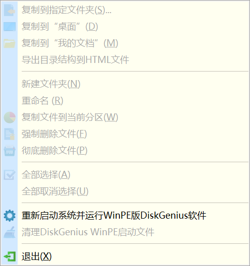

### 处理 BIOS 和分区

在确认新购置的笔记本电脑不存在质量问题、不需要退换后，可以继续进行部署操作；否则，本次教程结束。

重启进入 BIOS（Windows 10 及以上可在设置中系统选项卡的恢复中执行高级重启），设置 BIOS 管理员密码，并根据自己的偏好配置 BIOS；请务必牢记 BIOS 管理员密码！！！

绝大多数电脑在新机到手后只有一块只有一个分区的硬盘，如果不分区处理，会存在以下几个问题。

1) 未来什么软件都将无脑安装在分区 C（以下俗称“C 盘”）直至 C 盘被撑爆；
2) C 盘是系统盘，需要以较快的速度运行，过少的剩余空间会导致 C 盘工作效率低下，进而影响整个操作系统的效率；
3) C 盘是系统盘，UAC 控制与其它分区有所不同，普通资料文件放在 C 盘可能会导致每次打开时都需要打开资料文件的应用程序提权才能进行写入。
4) 如果没有第二个分区，使用分区上的软件操作其所在分区，可能会存在一些问题，如无法使用 DiskGenius 从 C 盘启动对 C 盘进行数据恢复操作。
5) 鸡蛋放在一个篮子里，难免会有些风险。

双击桌面的“此电脑”，展开设备和驱动器，检查盘符是否从 C 开始连续；如不连续，请停止继续操作，并自行使用分区工具进行调整。

右键单击本地磁盘后左键单击重命名或左键单击本地磁盘后按下 F2 键（部分电脑需配合 Fn 键），将 C、D、E 分区分别命名为 Windows、Software 和 Information。

对于不存在的分区，请跳过修改分区名称；如已存在三个或更多分区，可根据自己的偏好进行分区名称的修改，此时也无需往下进行分区操作。

前往 [DiskGenius 官网](https://www.diskgenius.cn/) 下载 DiskGenius。

打开并同意使用条款后，点击菜单栏“文件”中的“重新启动系统并运行 WinPE 版 DiskGenius 软件”，或进 Windows 预安装环境（Windows PE）后启动该软件。

在 Windows PE 模式下，如果 DiskGenius 存在以 Software 为卷标的磁盘而不存在以 Information 为卷标的磁盘，右键单击卷标为 Software 的磁盘调整分区大小，并将腾出的空间用于在当前分区后部建立新分区。

如果只存在以 Windows 为卷标的磁盘，则先分出 Software，再从 Software 中分出 Information。

调整时请注意：

1) 调整后的三个分区应均为主分区；
2) 在 DiskGenius 界面中显示的分区大小和 Windows 中显示的分区大小会有所出入，这实际上是单位问题（例如一个是 GB 一个是 GiB）；
3) 建议各分区（不含恢复分区等特殊分区）大小相对均匀。

参阅：网页 [https://goosebt.com:9001/home.html](https://goosebt.com:9001/home.html) 的安装包目录下的系统安装包中有一个 Windows 激活工具合集。
