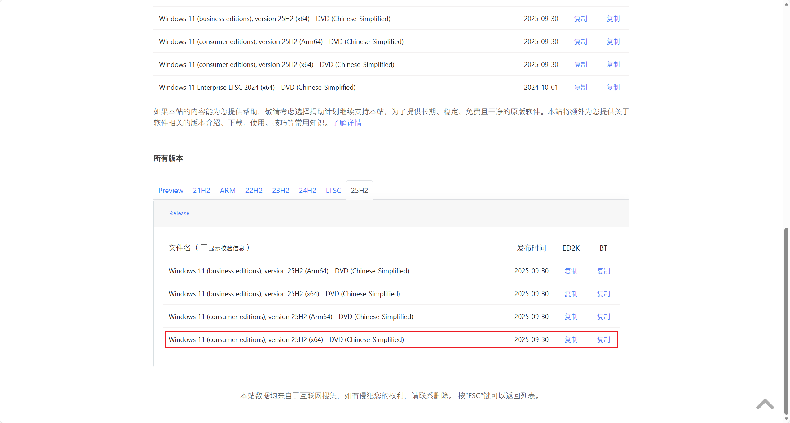
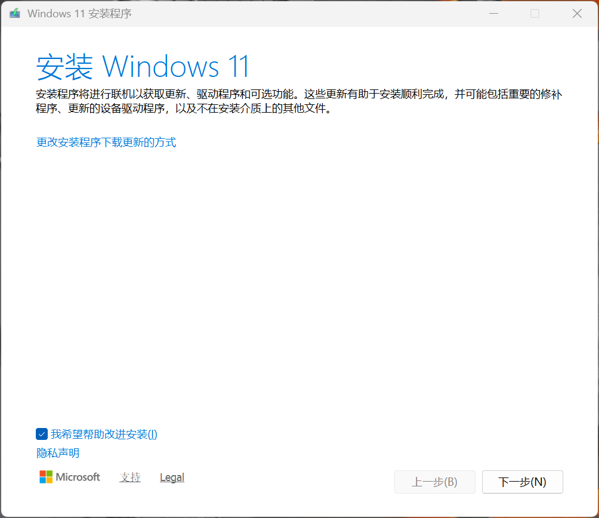
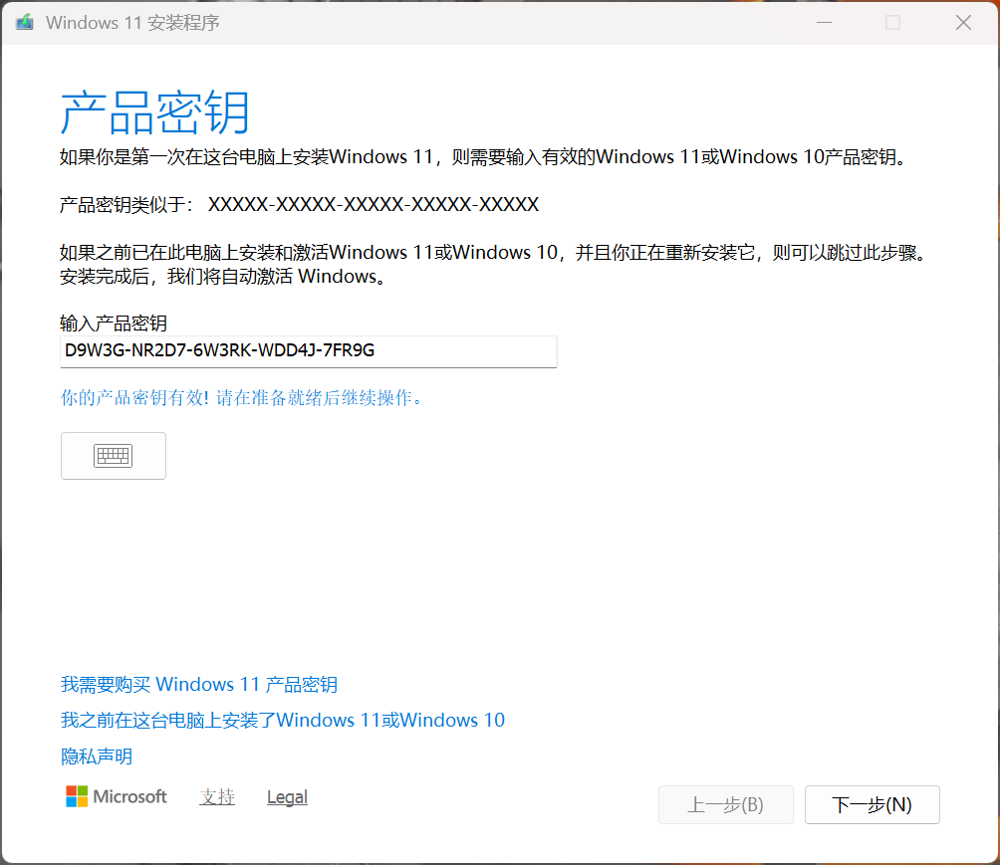
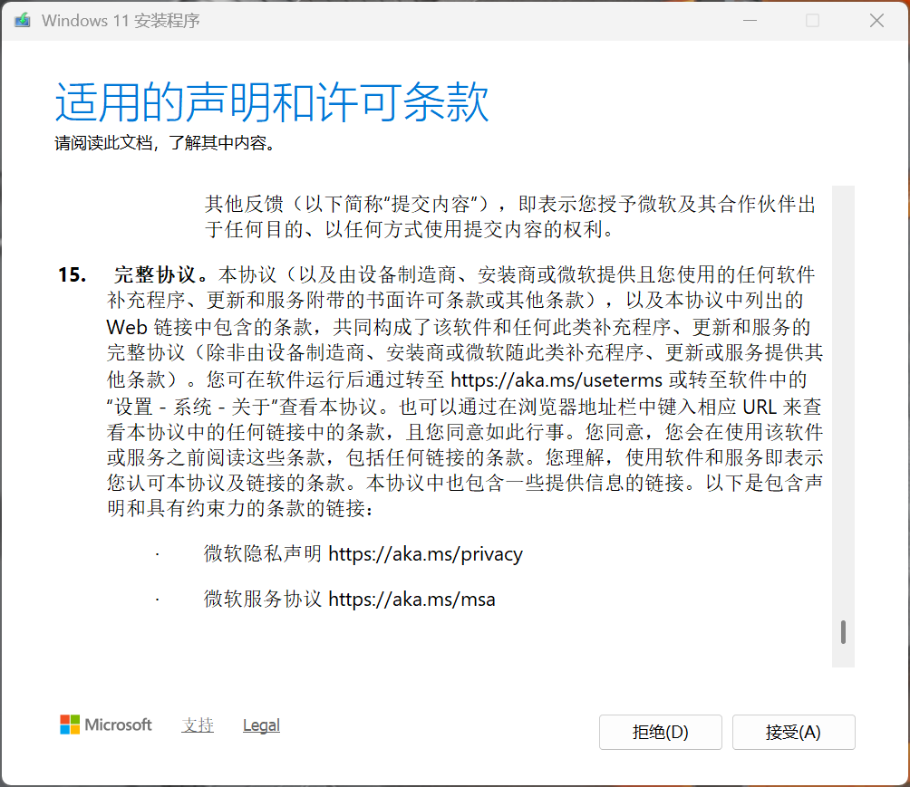
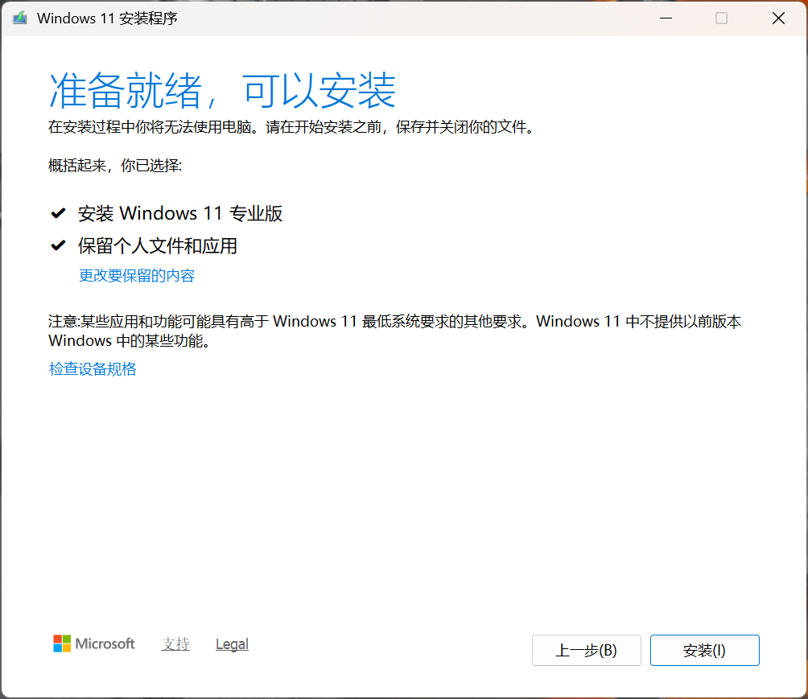
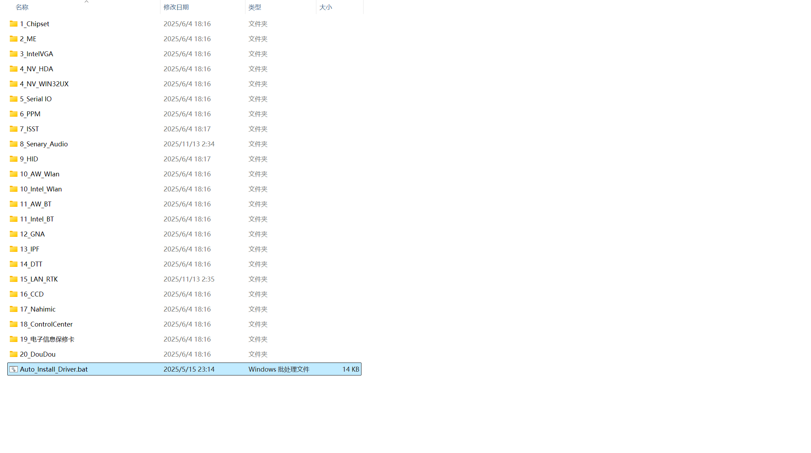

### 切换 Windows 为专业版

第一步，访问 [https://next.itellyou.cn/](https://next.itellyou.cn/)，登录后，找到 Windows 11，使用迅雷下载最新 customer 版的 Windows 11 镜像。

第二步，将下载的镜像转移至新购置的笔记本电脑的计算机上的某一位置，双击镜像文件，此时计算机会利用 Windows 系统自带的虚拟光驱创建一个新的虚拟分区；进入该虚拟分区，双击 Setup。

第三步，在弹出的窗口（如图）中点击“下一步”。

第四步，在网上随便找一个 Windows 11 专业版的产品密钥进行键入，显示密钥有效后，点击“下一步”。

第五步，阅读协议，点击“接受”。

第六步，点击“安装”，等待系统完成安装并重启至桌面；请直接使用默认值“安装 Windows 11 专业版”和“保留个人文件和应用”，此过程可能需要两个小时。

第七步，根据电脑厂家指引打开电脑厂家的控制中心，并完成相应的驱动安装和升级；例如，以机械革命为例，则应以管理员权限运行 ``D:\Driver\Auto_Install_Driver.bat``。

