### 编程环境部署

1) [Visual Studio](https://visualstudio.microsoft.com/)；
2) [Python](https://www.python.org/)；
3) [Git](https://git-scm.com/)。

将 Python 的部署放置于 Visual Studio 之后，是因为 Python 的某些功能需要依赖于 Visual Studio。

#### 一、Visual Studio

前往 [Visual Studio 官网](https://visualstudio.microsoft.com/)下载最新企业版 Visual Studio 安装包。

下载后，部分设备可能需要解除锁定，具体操作为：右键单击该文件，打开属性，在弹出的属性对话框中点击解除锁定，关闭属性对话框；本文档剩余部分将直接使用“解除锁定”来表达此行的内容。

双击运行 Visual Studio 安装包，如有 UAC 提权提示请点击确定允许提权。

Visual Studio 安装包解压后，会进入一个协议确认界面，点击“继续”。


等待初步的下载和安装完成，此过程不需要执行任何操作。

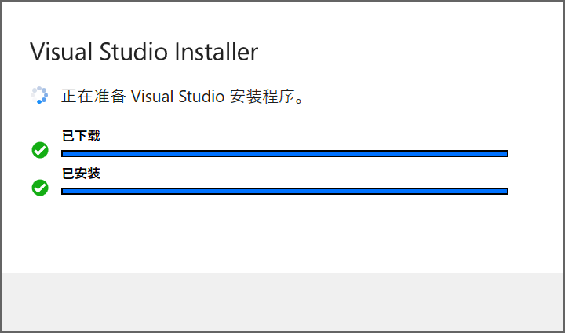

此时安装包可能会自动进入一个二级页面，该页面默认选定的是包含内测版中的最新企业版的 Visual Studio。

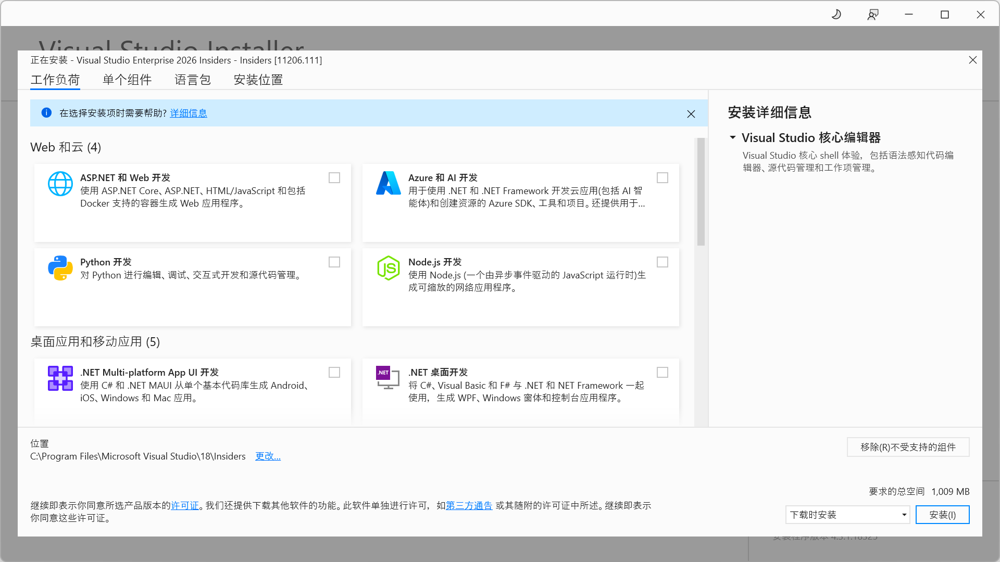

如不放心，可关闭该二级页面，切换至可用标签页，找到最新企业版的 Visual Studio，点击对应的“安装”按钮。

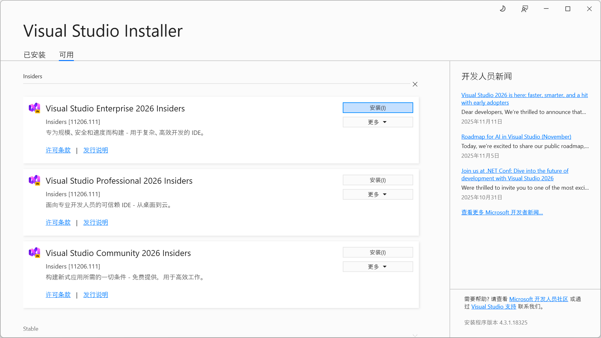

在工作负荷中勾选使用 C++ 的桌面开发，如有需要且 C 盘空间充足可以将右侧安装详细信息中的使用 C++ 的桌面开发中的可选项全部勾上。

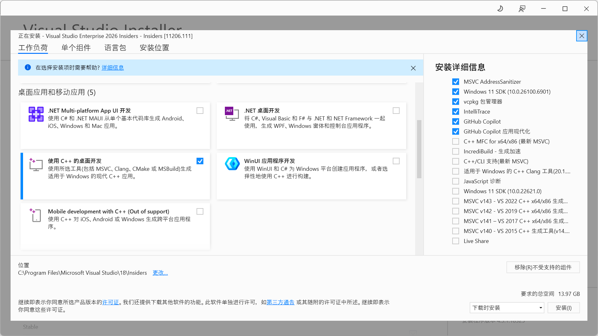

参阅[微软内核驱动开发文档](https://learn.microsoft.com/zh-cn/windows-hardware/drivers/gettingstarted/writing-a-very-small-kmdf--driver)勾选单个组件；
对于单个组件，不同版本的安装包可能有不同的名称或翻译，一个可能的方法为：在单个组件选项卡中直接搜索“Spectre 最新”并将筛选出来的单个组件全部勾上即可。

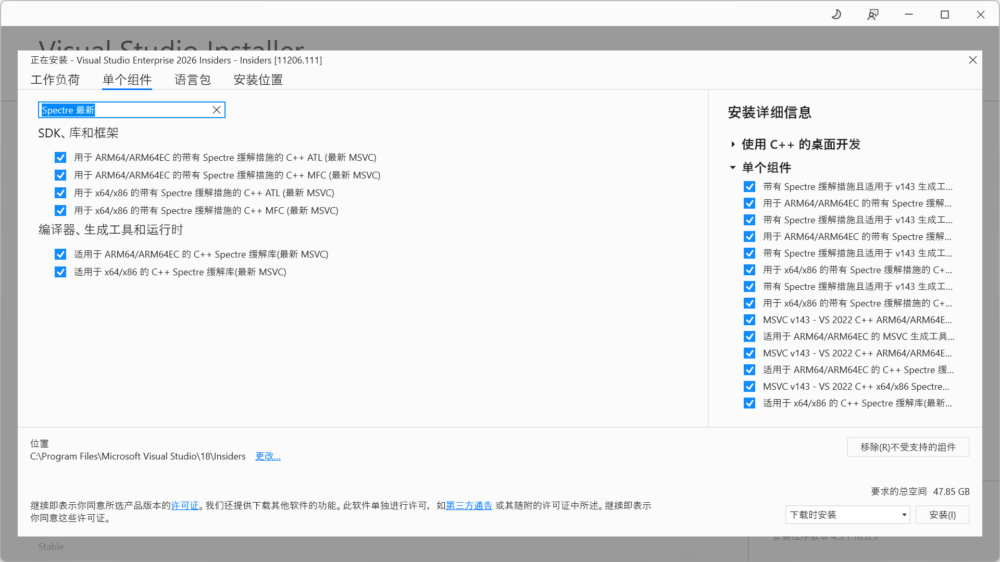

安装位置使用默认位置（考虑到 Visual Studio 也是微软的产品），开始执行安装，耐心等待安装完成。

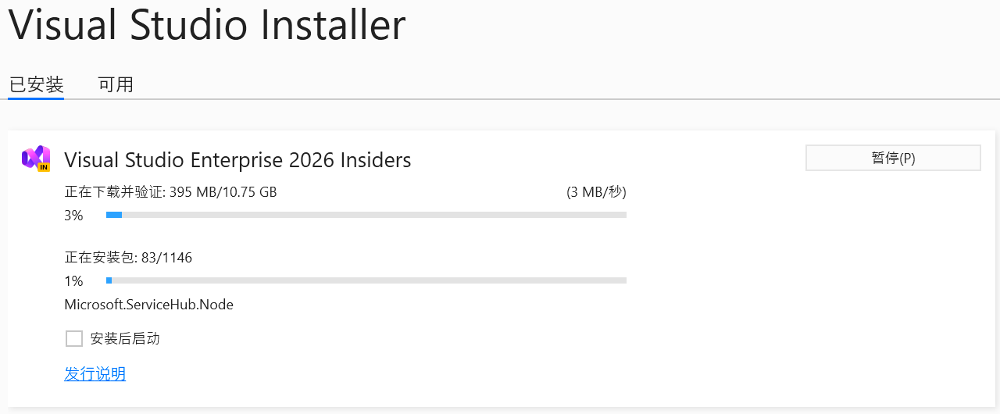

依照[微软内核驱动开发文档](https://learn.microsoft.com/zh-cn/windows-hardware/drivers/download-the-wdk)部署 SDK 和 WDK，使用默认位置，依照指引完成安装即可。

请注意，上述安装过程中，Visual Studio、SDK 和 WDK 的安装应当依次进行，不可并发进行。

重新启动 Windows，进入桌面后，打开 Visual Studio，依照指引完成微软账号登录，随后在简略的偏好界面选择常规、深色，点击继续启动 Visual Studio。

在 Visual Studio 的菜单栏中找到“帮助”，点击后在弹出的二级菜单中点击“注册 Visual Studio”，在网上随便找一个对应的 Visual Studio 企业版密钥进行输入，激活 Visual Studio。

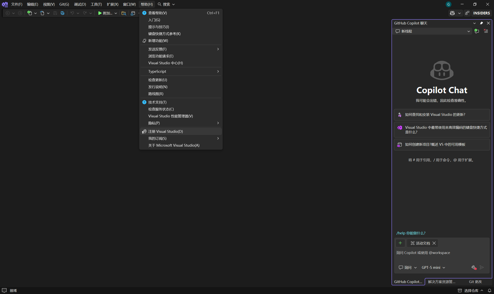

此时，Visual Studio 的 C/C++ 和内核驱动开发环境已基本部署完毕。

#### 二、Python

前往 [Python 官网](https://www.python.org/) 下载适合的安装包并解除锁定。

以管理员权限打开 Python 安装包，如有 UAC 提权提示请点击确定允许提权。

Python 安装包启动后，在 Python 安装包界面首页勾选下方两个选项，随后点击“Customize installation”。

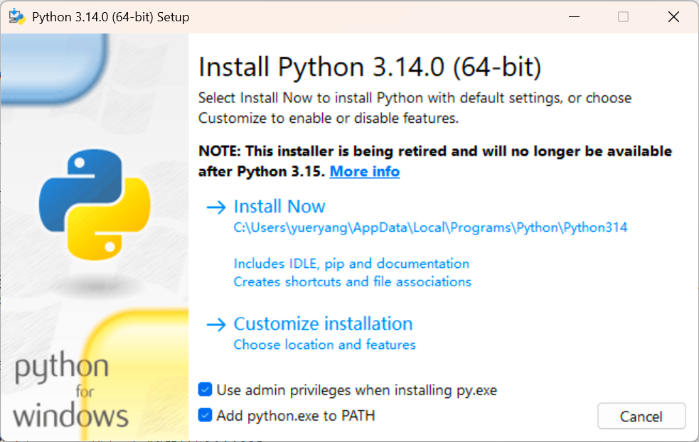

进入第二页后，所有勾号默认被勾上，如没有可手动勾上所有勾号，随后点击“Next”。

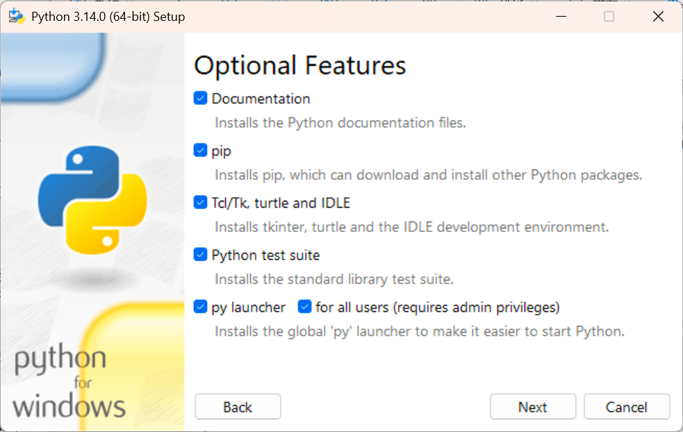

进入第三页后，将所有勾号勾上，随后将路径修改为 ``D:\Program Files\Python``；此路径可防止某些情况下使用 pip 安装第三方库时总是需要管理员权限，点击“Install”，等待安装完成。

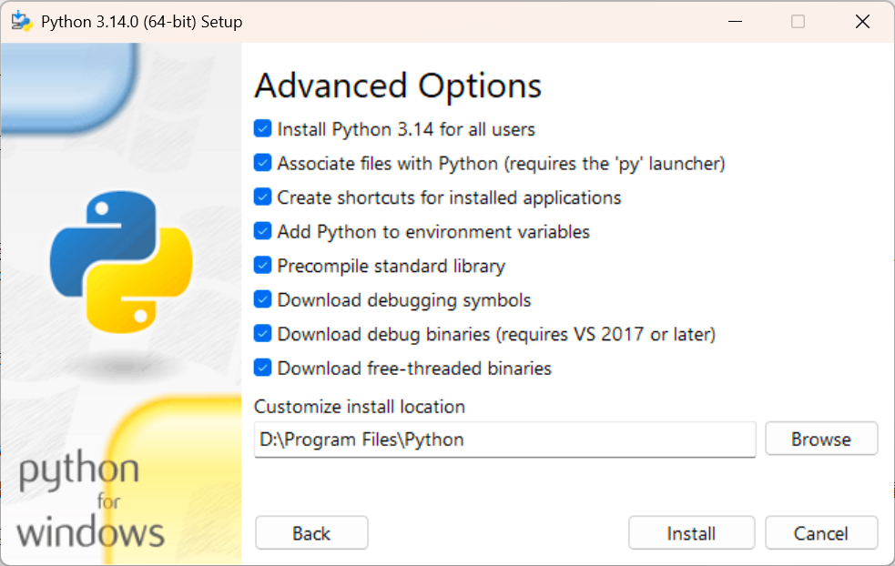

安装完成后，Python 安装包可能会询问你是否禁用最大路径限制，点击“Disable path length limit”即可，随后点击 Close 关闭窗口。

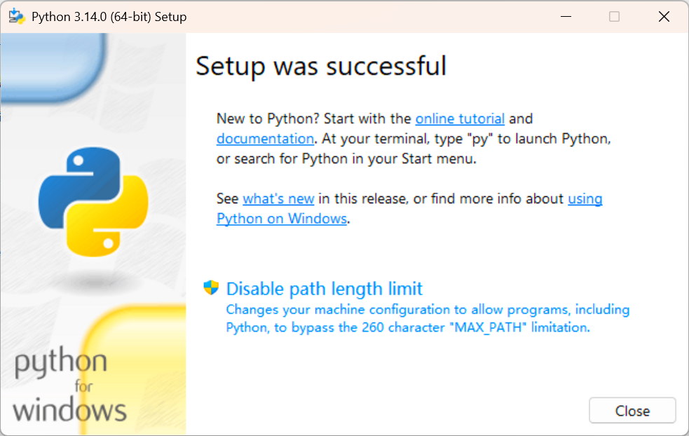

打开 cmd，输入 ``del /a /f /q "%USERPROFILE%\AppData\Local\Microsoft\WindowsApps\python.exe"`` 并回车以移除 Windows 自带的 Python，如提示找不到文件可忽略。

在 cmd 窗口中输入 ``py`` 或者 ``python`` 回车，若能正常进入 Python，则说明 Python 已经成功安装。

在 Python 中输入 ``quit()`` 或者 ``exit(0)`` 回车退出 Python，在 cmd 窗口中输入以下命令并回车将 pip 源切换为阿里源。

```
python -c "print('[global]\nindex-url = https://mirrors.aliyun.com/pypi/simple\ntimeout = 120')" > "%USERPROFILE%\pip\pip.ini"
```

在 cmd 窗口中输入 ``exit`` 并回车关闭 cmd 窗口，以管理员权限打开新的 cmd 窗口，键入 ``python -m pip install --upgrade pip`` 并回车以更新 pip。

在 pip 更新完成后，在具有管理员权限的 cmd 窗口中键入 ``pip install numpy pandas lxml matplotlib jupyter tqdm bs4 you-get``（可自行添加更多库）并回车以安装一些常用的第三方库。

检查目录 ``D:\Program Files\Python`` 和 ``D:\Program Files\Python\Scripts`` 是否在系统环境变量 PATH 中（可在 cmd 窗口中执行 ``set PATH`` 进行查看），如不在请将其添加至系统环境变量 PATH 中；
如有需要，可将 ``D:\Program Files\Python\Scripts\jupyter-notebook.exe`` 设置为 ``.ipynb`` 的默认打开程序（创建关联）。

至此，Python 部署完成。

#### 三、Git

前往 [Git 下载界面](https://git-scm.com/install/windows)下载 Git 安装包并解除锁定，右键单击该安装包，在弹出菜单中点击以管理员权限运行，在弹出界面中，依照指引接受许可协议。

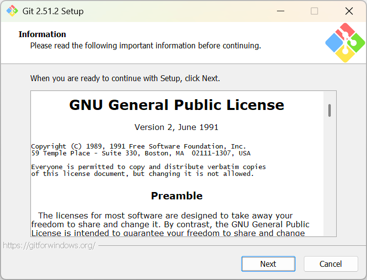

推荐将安装路径修改为 ``D:\Program Files\Git``（将默认路径中的驱动器号中的字母 ``C`` 修改为 ``D``），点击“Next”按钮。


将 Windows Explorer integration 及以下的行勾选，点击“Next”按钮。


继续点击“Next”按钮。

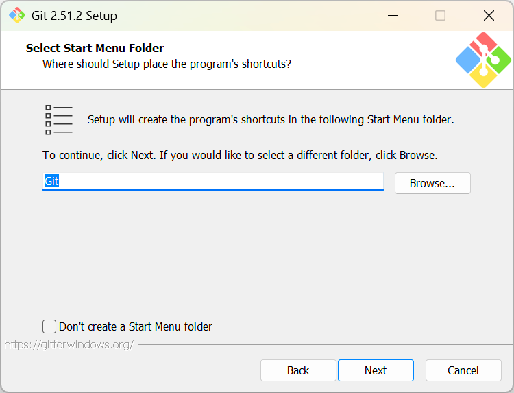

选择一个合适的编辑器，在某些情况下（例如分支冲突）Git 会要求用户审阅文件；骨灰级程序员可选择 Notepad（但感觉 Windows 11 开始的 Notepad 不怎么好用），点击“Next”按钮。

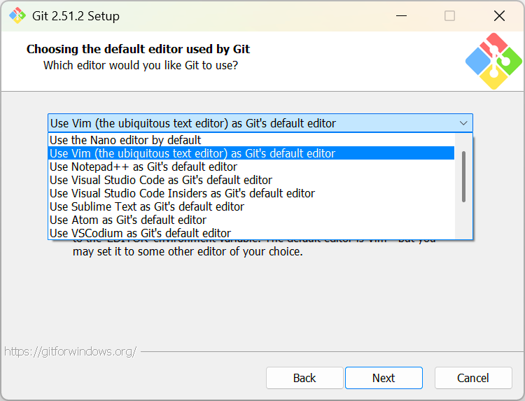

出于习惯，将默认分支设置为 main，点击“Next”按钮。

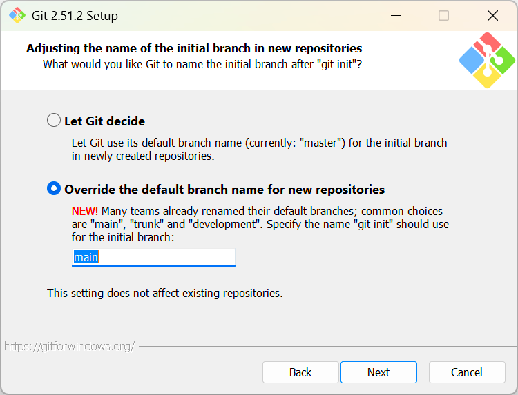

不太推荐将 Linux 下的习惯引入到 Windows 中（如果倾向于 Linux 应该直接安装 Linux 操作系统），继续点击“Next”按钮。


继续点击“Next”按钮。

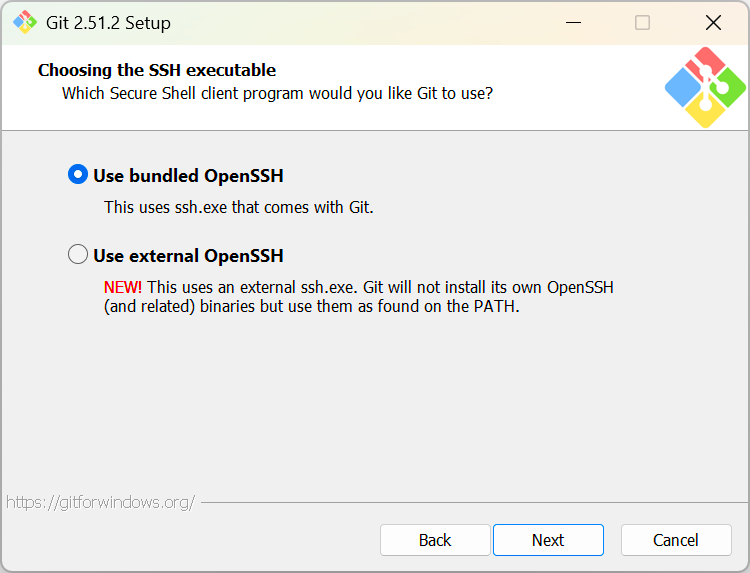

继续点击“Next”按钮。


建议不要干预行末标记，例如在 Windows 的 Visual Studio 中编写 shell 脚本必须保持 LF，否则可能无法在 Linux 上正确执行代码，因此，选择 ``Checkout as-is, commit as-is``，继续点击“Next”按钮。

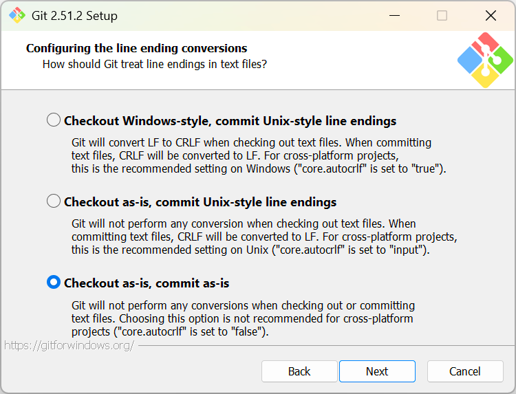

根据自己的偏好进行选择，继续点击“Next”按钮。

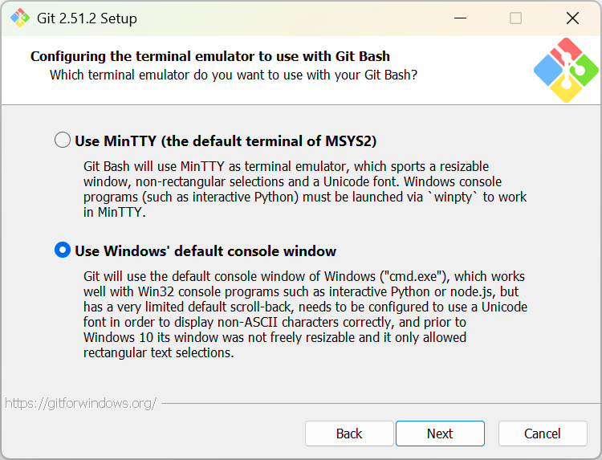

继续点击“Next”按钮。


继续点击“Next”按钮。

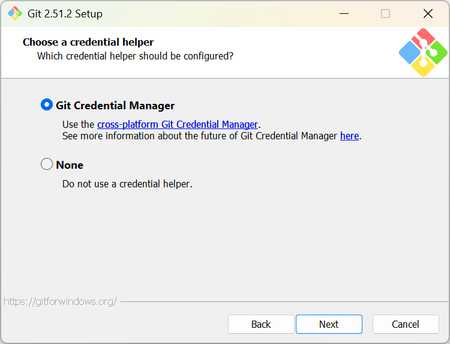

勾选所有选项（启用链接是为了在 Windows 上兼容 Linux），点击“Install”按钮开始安装。

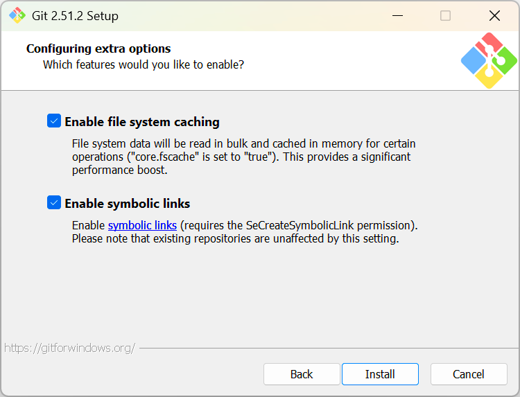

等待安装完成，点击“Finish”。

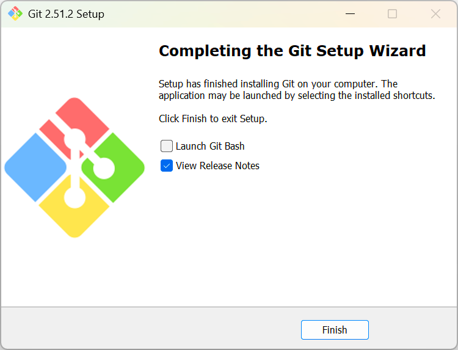

此时，如果没有 ``.html`` 文件关联，可将 Micorsoft Edge 设置为默认的 ``.html`` 文件打开方式，也可在安装 Google Chrome 后将 Google Chrome 设置为默认的 ``.html`` 文件打开方式。

打开 cmd，键入 ``git config --global user.name ``（注意结尾处有个空格），随后键入 GitHub 账户名，回车。

访问 [https://github.com/settings/emails](https://github.com/settings/emails)，登录 GitHub 后，在此页面将所有邮箱设置为私有；
将 Keep my email addresses private 和 Block command line pushes that expose my email 打开，返回 cmd，键入 ``git config --global user.email ``（注意结尾处有个空格）；
返回 GitHub 界面，复制 Keep my email addresses private 中显示的虚拟邮箱，随后返回 cmd 界面进行粘贴并回车。

此时，Git 部署完成，可尝试使用 ``git clone``、``git pull`` 和 ``git push`` 等简单指令自行进行测试。
